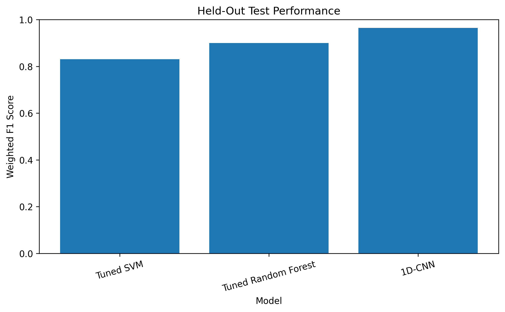
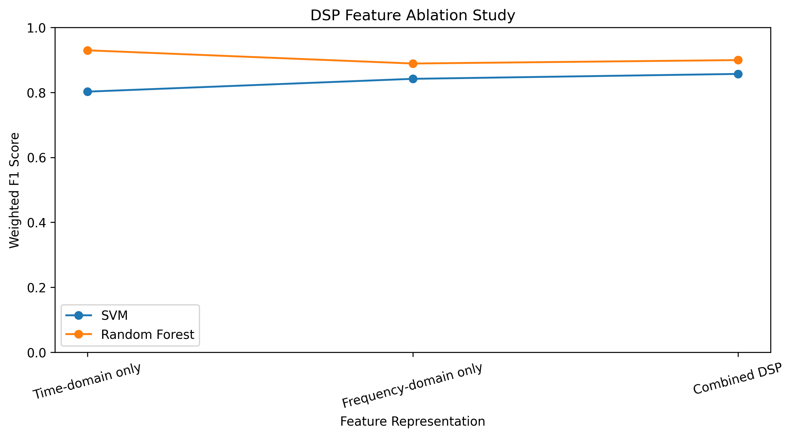
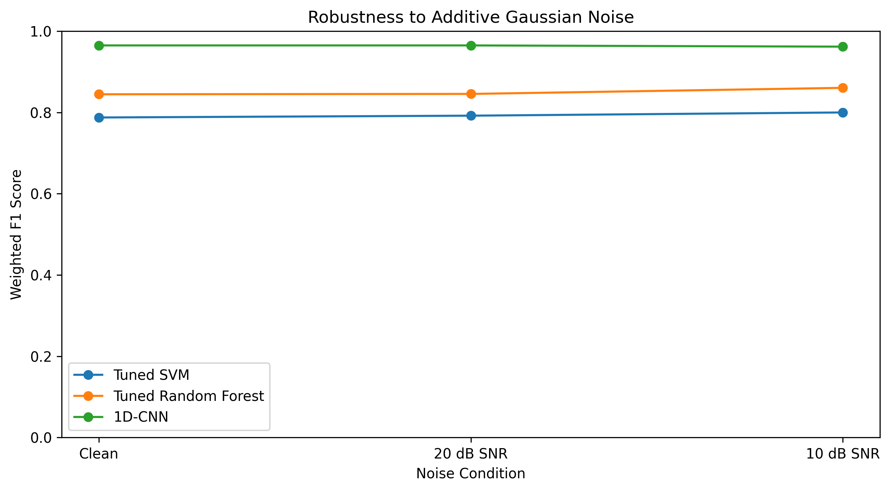
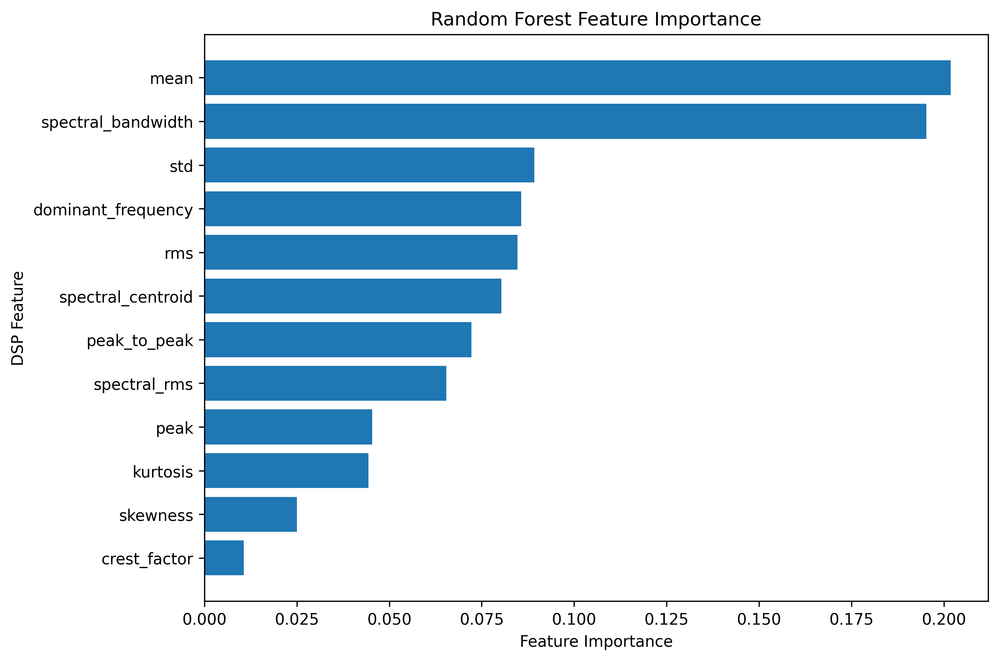

OIST-Bearing-Fault-Diagnosis
DSP-Based Bearing Fault Diagnosis Using Vibration Signals and Machine Learning
A research-oriented vibration-signal processing and machine-learning project investigating whether compact DSP features can support reliable bearing-condition diagnosis while reducing the representation size relevant to resource-constrained edge systems.
> **Research question:** Can DSP-based vibration features enable reliable bearing-condition diagnosis while maintaining a compact computational footprint suitable for resource-constrained edge devices?
---
Project Overview
This project develops an end-to-end bearing-vibration diagnosis pipeline:
Raw vibration → DSP preprocessing → segmentation → time/frequency-domain features → recording-aware evaluation → classical ML + 1D-CNN → ablation → noise robustness → edge-oriented profiling → reproducibility
The project uses vibration recordings from the Case Western Reserve University (CWRU) bearing dataset, using the same source repository as the original project.
The notebook is designed as a reproducible research experiment rather than a demonstration based on random window-level train/test splitting.
---
Key Experimental Results
The final held-out test set produced the following measured results:
Model	Accuracy	Balanced Accuracy	Weighted F1	Macro F1
Tuned SVM	0.8267	0.8260	0.8308	0.8228
Tuned Random Forest	0.8990	0.9284	0.8996	0.9158
1D-CNN	0.9657	0.9526	0.9649	0.9599
These values describe the measured performance on the selected held-out recordings for this experimental setup. They should not be interpreted as universal performance across other machines, sensors, operating conditions, or datasets.
DSP Feature Ablation
Weighted F1 on the held-out test set:
Feature representation	SVM	Random Forest
Time-domain only	0.8024	0.9297
Frequency-domain only	0.8419	0.8891
Combined DSP	0.8571	0.8996
The ablation experiment quantifies how the time- and frequency-domain feature groups contribute to the evaluated models.
Robustness to Controlled Gaussian Noise
Weighted F1:
Condition	Tuned SVM	Tuned Random Forest	1D-CNN
Clean	0.7875	0.8447	0.9649
20 dB SNR	0.7920	0.8455	0.9649
10 dB SNR	0.7999	0.8605	0.9619
Noise experiments use controlled additive Gaussian noise on the held-out test windows. The measurements are intended as a robustness experiment, not as a complete model of real-world sensor noise.
---
Methodology
1. DSP preprocessing
Sampling frequency: 12 kHz
4th-order Butterworth low-pass filter
Cutoff frequency: 2 kHz
Zero-phase filtering using `filtfilt`
2. Signal segmentation
Each recording is divided into:
1-second windows
12,000 samples per window
50% overlap
Maximum of 100 windows per recording in the current runtime configuration
3. Engineered DSP features
Time-domain
Mean
RMS
Standard deviation
Peak
Peak-to-peak
Crest factor
Kurtosis
Skewness
Frequency-domain
Spectral centroid
Dominant frequency
Spectral RMS
Spectral bandwidth
The classical ML representation therefore contains 12 engineered values per window.
4. Machine-learning models
Classical ML
RBF-kernel SVM
Random Forest
Standardization for SVM
Recording-aware grouped cross-validation
Training-only hyperparameter tuning
Deep learning
A 1D-CNN receives the raw vibration waveform directly.
The CNN uses:
Conv1D layers
Max pooling
Global average pooling
Dense layer
Dropout
Softmax output
---
Leakage Prevention and Validation Design
A major focus of the project is preventing leakage caused by overlapping windows from the same recording.
The evaluation therefore uses recording-level groups rather than treating every window as an independent recording.
The methodology includes:
Windows from a recording never cross an evaluation boundary.
Held-out test recordings are selected before model fitting.
SVM and Random Forest hyperparameters are selected using training recordings only.
Classical-model cross-validation is restricted to the training recordings.
CNN normalization statistics are calculated from CNN training recordings only.
CNN training, validation, and test recordings are separated.
Explicit recording-overlap checks are performed.
The final test set is kept untouched during model selection.
The notebook reports recording overlap explicitly so the evaluation can be audited.
---
Dataset
The project uses the CWRU bearing vibration dataset through the `XiongMeijing/CWRU-1` repository.
The notebook downloads the dataset automatically when executed in Google Colab.
The current experiment contains:
49 independent recordings
3,132 feature windows
3,132 raw waveform windows
4 condition labels
The condition labels are derived from the dataset directory structure rather than manually invented inside the notebook.
The dataset itself is not included in this repository.
---
Why Compare DSP Features with a Raw-Signal CNN?
The project intentionally evaluates two different representations:
Compact DSP representation
12 engineered values per window.
This is useful for investigating:
interpretability
classical ML
memory requirements
potential edge deployment
Raw waveform representation
12,000 samples per window.
This allows the 1D-CNN to learn representations directly from the vibration waveform.
The comparison is therefore not only about predictive metrics; it also considers representation size and computational implications.
---
Representation Memory
For 32-bit floating-point values:
DSP feature vector: 12 values = 48 bytes ≈ 0.047 KB
Raw waveform window: 12,000 values = 48,000 bytes ≈ 46.875 KB
Raw-to-feature representation memory ratio: approximately 1000×
This illustrates the difference between transmitting/storing a compact engineered representation and retaining a complete waveform window.
---
Random Forest Feature Analysis
The feature-importance analysis provides a descriptive view of which engineered DSP variables contributed most to the trained Random Forest.
The highest measured importances in the experiment included:
Mean — 0.2019
Spectral bandwidth — 0.1952
Standard deviation — 0.0892
Dominant frequency — 0.0857
RMS — 0.0846
Spectral centroid — 0.0803
Peak-to-peak — 0.0722
Spectral RMS — 0.0655
Feature importance is interpreted descriptively and is not treated as causal evidence.
---
Repository Structure
```text
OIST-Bearing-Fault-Diagnosis/
│
├── README.md
├── requirements.txt
├── .gitignore
│
├── notebooks/
│   └── OIST_Bearing_Fault_Diagnosis.ipynb
│
├── results/
│   ├── README.md
│   ├── dsp_ablation.csv
│   ├── edge_profile.csv
│   ├── final_heldout_test_metrics.csv
│   ├── noise_robustness.csv
│   ├── random_forest_feature_importance.csv
│   ├── recording_audit.csv
│   ├── report_ready_summary.csv
│   ├── representation_memory.csv
│   ├── training_only_grouped_cv.csv
│   └── training_only_grouped_cv_summary.csv
│
├── figures/
│   ├── README.md
│   ├── dsp_ablation.png
│   ├── feature_importance.png
│   ├── model_performance.png
│   └── noise_robustness.png
│
└── src/
    └── README.md
```
---
Reproducibility
The notebook records the main experimental configuration, including:
Random seed: `42`
Sampling frequency: `12000 Hz`
Low-pass cutoff: `2000 Hz`
Filter order: `4`
Window length: `1 second`
Window size: `12000 samples`
Overlap: `50%`
Maximum windows per recording: `100`
The notebook also exports experiment tables to CSV so that results can be inspected without rerunning every analysis cell.
---
Edge-Deployment Perspective
The project includes software-level profiling of:
DSP + feature extraction
SVM inference
Random Forest inference
1D-CNN inference
feature-vector memory
raw-waveform memory
CNN parameter count
These timings are explicitly Colab/software measurements, not hardware benchmarks.
A real deployment study would require benchmarking on the intended microcontroller or edge processor.
---
Limitations
The results should be interpreted within the scope of the dataset and experimental setup.
Important limitations include:
The number of independent recordings is relatively small in at least one class.
The number of windows is much larger than the number of independent recordings, so windows should not be interpreted as independent physical experiments.
CNN recording-aware validation can have incomplete class coverage because of the recording structure. This is treated as a dataset-structure limitation.
Robustness testing currently uses controlled additive Gaussian noise.
Edge profiling is performed in software rather than on a physical embedded target.
Cross-load and cross-speed generalization has not yet been established.
Results have not yet been validated on a second independent bearing dataset.
---
Future Work
Potential extensions include:
Increase the number of windows per recording after confirming runtime.
Evaluate different window lengths and filter cutoffs.
Add envelope analysis and bearing-characteristic frequency features.
Quantize or compress the CNN for TinyML deployment.
Benchmark the complete pipeline on an actual microcontroller or edge board.
Validate the approach on a second bearing dataset.
Investigate cross-load and cross-speed generalization.
---
How to Run
Google Colab
Open the notebook:
`notebooks/OIST_Bearing_Fault_Diagnosis.ipynb`
Run the cells from top to bottom.
The notebook downloads the dataset automatically.
The experiment generates evaluation tables and figures.
Exported CSV results are written to the `oist_final_results` directory in the runtime.
Local environment
Install the dependencies:
```bash
pip install -r requirements.txt
```
Then open the notebook with Jupyter or another compatible notebook environment.
---
Research Claim Discipline
This project supports conclusions about the measured experimental setup and dataset.
It does not establish universal performance across:
all bearing types
all operating conditions
all sensors
all machines
all embedded processors
A strong next step is validation on a second dataset and/or hardware benchmarking on a target edge device.
---
Figures
Held-Out Model Performance

DSP Feature Ablation

Robustness to Additive Gaussian Noise

Random Forest Feature Importance

---
Project Status
Final research notebook completed.
The repository contains the reproducible notebook, exported experimental results, research figures, dependency specification, and documentation.
---
Author
Aditi Gaonkar  
Electronics & Communication Engineering (AI & ML)  
MIT World Peace University
